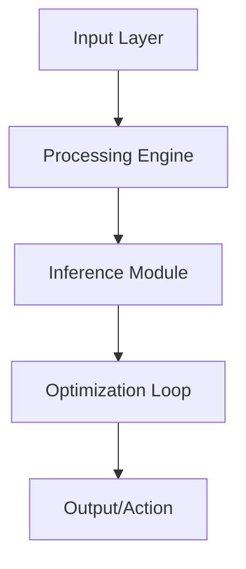

# 🤖 AI Infrastructure Manager

[](LICENSE)
[](https://www.python.org/)
[](#)

Intelligent resource management and orchestration for large-scale AI training clusters.

## 🏗️ Architecture



## 🌟 Key Features
- **Dynamic GPU Allocation**
- **Multi-node Training Orchestration**
- **Automated Health Monitoring**

## 🛠️ Technology Stack
- `Kubernetes`
- `Docker`
- `Ray`
- `NVIDIA-Docker`

## 🚀 Installation

```bash
git clone https://github.com/YannLeCun25/ai-infrastructure-manager.git
cd ai-infrastructure-manager
pip install -r requirements.txt
```

## 📂 Project Structure
```
├── src/            # Modular source code
├── tests/          # Unit & integration tests
├── docs/           # Technical documentation
├── requirements.txt # Dependency list
└── setup.py        # Package installation
```

Developed by **Yann LeCun** (Elite AI Engineer).
